# Diagnostic graph messages

These are messages that represent aggregated diagnostic graphs.
Diagnostic graph structure is static, so it is published only once as the DiagGraphStruct.
And diagnostic status that changes dynamically is periodically published as the DiagGraphStatus.
The DiagGraphStruct and DiagGraphStatus have the list of nodes and links, and their indices correspond.

## Sample graph

## Sample message

